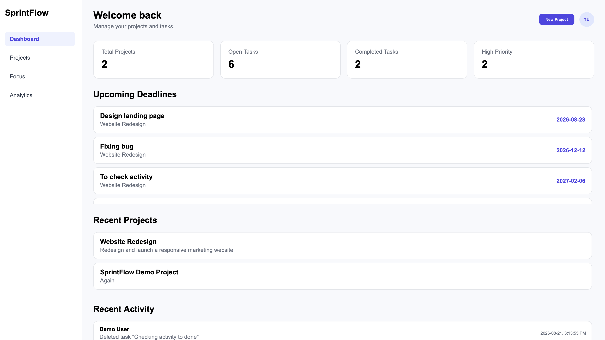
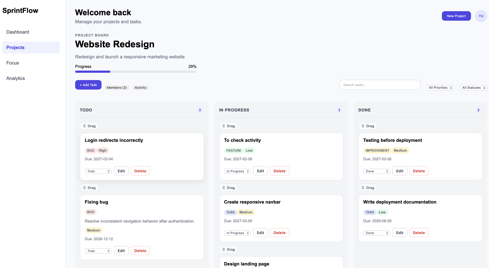
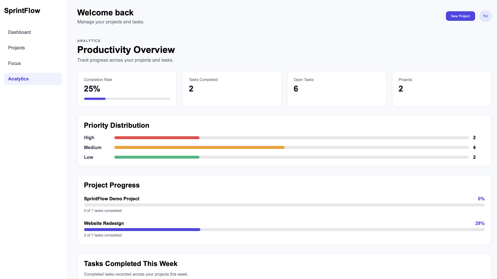
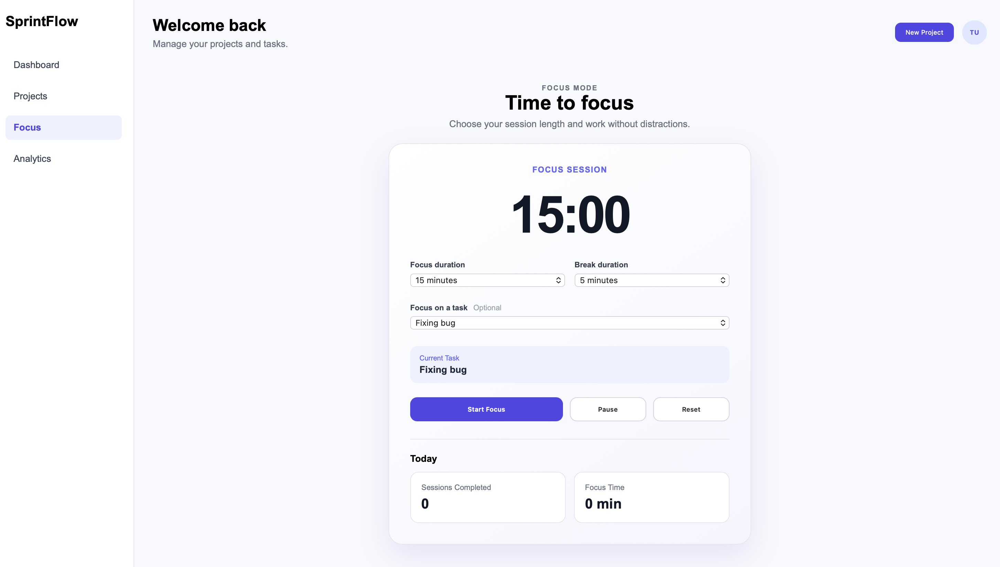

# SprintFlow

SprintFlow is a full-stack project and task management application designed to help users organize projects, track tasks, monitor deadlines, and understand their productivity through a centralized workspace.

## Live Demo

**Live Application:** [SprintFlow](https://sprintflow-1y73.onrender.com)

> The application is hosted on Render. The backend may take a short time to wake up after a period of inactivity.

## Features

- Secure user registration and login with JWT authentication
- Create and manage multiple projects
- Create, update, prioritize, and delete tasks
- Organize tasks by status, priority, and due date
- Dashboard with project statistics, upcoming deadlines, recent projects, and activity
- **Focus workspace** for viewing and prioritizing active tasks that need attention
- **Analytics dashboard** for visualizing task completion, workload, priorities, and project progress
- Activity tracking for important project and task actions
- Persistent PostgreSQL data storage
- Protected routes for authenticated users
- End-to-end workflow testing with Playwright

## Tech Stack

### Frontend
- React
- Vite
- React Router
- CSS

### Backend
- Node.js
- Express.js
- REST API
- JWT authentication
- bcrypt

### Database
- PostgreSQL

### Testing & Deployment
- Playwright
- Git & GitHub
- Render

## Architecture

SprintFlow follows a full-stack client-server architecture:

```text
React Frontend
      |
      | REST API
      v
Node.js / Express Backend
      |
      v
PostgreSQL Database
```

The React frontend communicates with the Express REST API for authentication and application data, while PostgreSQL provides persistent storage for users, projects, tasks, project members, and activity records.

## Running Locally

### 1. Clone the repository

```bash
git clone https://github.com/parneet-kaur14/SprintFlow.git
cd SprintFlow
```

### 2. Install frontend dependencies

```bash
cd client
npm install
```

### 3. Install backend dependencies

```bash
cd ../server
npm install
```

### 4. Configure backend environment variables

Create a `.env` file inside the `server` folder:

```env
DB_HOST=
DB_PORT=
DB_NAME=
DB_USER=
DB_PASSWORD=
JWT_SECRET=
```

Add your local PostgreSQL connection details and a secure JWT secret.

### 5. Configure the frontend API URL

Create a `.env` file inside the `client` folder:

```env
VITE_API_URL=http://localhost:5050
```

If `VITE_API_URL` is not provided, SprintFlow defaults to `http://localhost:5050`.

### 6. Start the backend

From the `server` folder:

```bash
npm run dev
```

The backend runs on:

```text
http://localhost:5050
```

### 7. Start the frontend

Open a second terminal:

```bash
cd client
npm run dev
```

Vite will display the local application URL, typically:

```text
http://localhost:5173
```

Open the URL in your browser to use SprintFlow locally.

## Testing

SprintFlow includes Playwright end-to-end tests covering authentication and core project and task management workflows.

```bash
npx playwright test
```
## Screenshots

### Dashboard

Overview of projects, tasks, deadlines, and recent activity.



### Project Board

Kanban-style project workspace for managing tasks across Todo, In Progress, and Done.



### Analytics

Productivity insights including completion rate, priority distribution, and project progress.



### Focus Mode

Built-in focus timer for dedicated work sessions with optional task tracking.



## Author

**Parneet Kaur**  
Computer Science Co-op — University of Guelph 